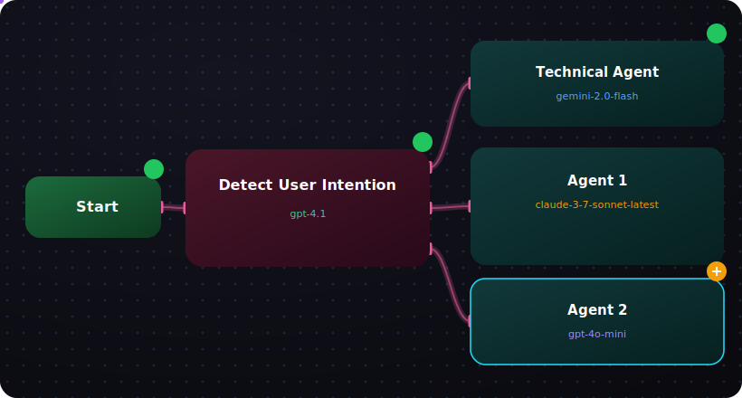

 #  QuantMessage — Multi-Agent AI Messaging Platform

<p align="center">
  
</p>

<p align="center">
  <a href="https://flutter.dev"></a>
  <a href="https://supabase.com"></a>
  <a href="https://dart.dev"></a>
  
</p>

> **The Future of Intelligent Messaging.**  
> QuantMessage is a multi-agent AI conversation platform that routes user intent to specialized autonomous agents, each powered by a different large language model, and returns synthesized responses in real time.

🔗 **Prefer a pure HTML/CSS version of the diagram?**  
Open [`connectors-animation.html`](connectors-animation.html) in any browser to see the CSS `offset-path` animation demo.

---

## ✨ System Workflow (Live Diagram)

The animation above (rendered from `connectors-animation.svg`) maps **exactly** to the backend execution flow of QuantMessage:


- 🟢 **Start** — User completes Supabase authentication and session is established
- 🔴 **Detect User Intention** — A primary routing model (`gpt-4.1`) classifies the user's prompt and decides which specialist agent(s) should handle it
- 🔵 **Parallel Agents** — Three independent agent nodes execute concurrently, each calling a distinct model provider via the QuantSpace API

> 💡 The SVG animates automatically on GitHub via SMIL + embedded CSS. No JavaScript is required for the README preview.

---

## 📡 What is QuantMessage?

QuantMessage is a backend-driven conversational system designed to abstract away the complexity of multi-LLM orchestration. Instead of a user needing to pick a model, the system:

1. Receives a raw natural-language message
2. Runs intent detection to understand the task type (technical, creative, analytical, etc.)
3. Dispatches the task to one or more specialized agents
4. Aggregates and streams the response back to the client

The platform is **model-agnostic** — agents are configured via a central `Config` registry, meaning new providers can be added without changing application logic.

---

## 🏗 System Architecture

| Component | Responsibility |
|-----------|---------------|
| **Client Layer** | Flutter app managing secure storage of session tokens and WebSocket/HTTP streaming |
| **Auth Layer** | Supabase Auth issuing JWTs; Row-Level Security (RLS) policies enforcing per-user data isolation |
| **Trigger Layer** | Supabase PostgreSQL function `handle_new_user` auto-creates a `profiles` row on signup |
| **Routing Layer** | `Detect User Intention` node — a classifier LLM that maps prompts to agent IDs |
| **Execution Layer** | `QuantSpaceApi` service performing parallel async calls to model endpoints |
| **Persistence Layer** | Supabase Postgres storing messages, agent metadata, and conversation threads |

---

## 🔐 Authentication & User Lifecycle

QuantMessage uses **Supabase Auth** as the single source of truth for identity:

1. User submits `email` + `password` + `full_name` via the signup form
2. `supabase.auth.signUp()` creates the auth user and triggers a database function
3. A `profiles` table row is inserted automatically (no manual insert needed)
4. On success, the client receives a session object containing a JWT
5. All subsequent API calls to QuantSpace include the user ID for traceability

Failed auth throws `AuthException` which is caught and surfaced to the user with a descriptive message.

---

## 🧠 Multi-Agent Routing Logic

The core differentiator of QuantMessage is its **agent graph**:

- **Technical Agent** → `gemini-2.0-flash` for code, debugging, and infrastructure questions
- **Agent 1** → `claude-3-7-sonnet-latest` (+ web tool) for reasoning-heavy and research tasks
- **Agent 2** → `gpt-4o-mini` for fast, lightweight conversational replies (marked active/spinning)

The router (`gpt-4.1`) scores the incoming prompt and may invoke one, two, or all three agents in parallel. Each agent returns a partial result; the system merges them into a single coherent message.

---

## ⚙️ QuantSpace API Integration

The `QuantSpaceApi` service is the bridge between the Flutter client and the model providers:

```dart
// Example call from signup flow
final welcomeModel = Config.models[0];
await _api.getAIResponse(
  "Hello AI, I just created an account using ${welcomeModel.name}.",
  response.user!.id,
);

# QuantMessage - Multi-Agent AI Messaging Platform

[](https://github.com/YOUR_USERNAME/YOUR_REPO/blob/main/connectors-animation.html)

> **Note**: Click the animated GIF above to view the interactive HTML version in a new tab!

## 🚀 Overview

QuantMessage is a cutting-edge **multi-agent AI messaging platform** that revolutionizes how users interact with intelligent AI systems. Built with Flutter and powered by Supabase, this application provides a sophisticated AI agent processing pipeline with real-time communication capabilities, secure authentication, and an intuitive user experience.

Unlike traditional chatbot applications, QuantMessage employs a **three-tier AI architecture** where different specialized agents process user queries sequentially, ensuring accurate and contextually appropriate responses. The platform is designed for developers, researchers, and enterprises who need advanced AI-powered communication tools.

## 🎯 Core Functionality

### Multi-Agent AI Processing Pipeline

QuantMessage implements a sophisticated **workflow orchestration system** that routes user queries through multiple specialized AI agents:

1. **User Intention Detection**: Automatically analyzes incoming messages to determine the appropriate processing pathway
2. **Technical Agent**: Handles complex technical queries, code generation, and system-related tasks
3. **Agent 1 & Agent 2**: Secondary processing agents that provide specialized expertise in specific domains

This multi-stage approach ensures that each query receives the most appropriate AI expertise, resulting in higher quality responses and more accurate problem-solving.

### Real-Time Communication Engine

Built on **Supabase's real-time infrastructure**, QuantMessage delivers instant message delivery across all connected clients. The platform supports:

- **Instant message synchronization** across devices
- **Presence indicators** showing online/offline status
- **Message history** with full search functionality
- **Typing indicators** for enhanced conversational flow
- **Read receipts** to track message engagement

### Secure Authentication System

The platform implements a **robust authentication framework** using Supabase's industry-standard security protocols:

- **Email/Password Authentication**: Secure credential-based login system
- **Session Management**: Automatic session persistence and renewal
- **Password Security**: Bcrypt hashing with industry-standard encryption
- **Account Verification**: Email verification workflow
- **Secure Data Storage**: All user data is encrypted at rest and in transit

### Intelligent Data Management

QuantMessage utilizes a **PostgreSQL database** with sophisticated data modeling:

- **User Profiles**: Extended user information including preferences and settings
- **Message Threading**: Organized conversation threads with metadata
- **Agent Context**: AI agent-specific context storage for personalized responses
- **Audit Trails**: Comprehensive logging for security and debugging
- **Scalable Architecture**: Database design optimized for horizontal scaling

## 🛠️ Technical Architecture

### Backend Infrastructure

The platform is built on **Supabase**, an open-source Firebase alternative that provides:

- **PostgreSQL Database**: Reliable, ACID-compliant relational database
- **Authentication Service**: JWT-based authentication with social login support
- **Real-Time Engine**: WebSocket-powered real-time data synchronization
- **Storage Service**: Secure file storage with CDN distribution
- **Edge Functions**: Serverless functions for custom business logic

### Frontend Framework

Built with **Flutter**, the application offers:

- **Cross-Platform Compatibility**: Single codebase for web, mobile, and desktop
- **High Performance**: Native compilation for optimal speed
- **Rich UI Components**: Pre-built widgets with extensive customization
- **State Management**: Provider pattern for predictable state management
- **Hot Reload**: Rapid development with instant code updates

### API Integration Layer

The `QuantSpaceApi` service provides seamless communication with external AI services:

- **Multi-Provider Support**: Integration with various AI model providers
- **Request Routing**: Intelligent routing to appropriate AI agents
- **Response Processing**: Standardized response formatting
- **Error Handling**: Comprehensive error management and recovery
- **Rate Limiting**: Automatic rate limiting and retry mechanisms

## 📊 Data Flow & Processing

### Message Lifecycle

1. **Message Creation**: User composes and sends a message
2. **Intention Detection**: System analyzes message content and context
3. **Agent Routing**: Message is routed to appropriate AI agents
4. **Processing**: AI agents generate responses using their specialized knowledge
5. **Response Assembly**: Responses are compiled and formatted
6. **Delivery**: Final response is sent back to the user
7. **Persistence**: Conversation is stored in the database

### Security Model

QuantMessage implements a **zero-trust security model**:

- **End-to-End Encryption**: All messages are encrypted in transit
- **Role-Based Access Control**: Fine-grained permission system
- **Data Validation**: Input sanitization at all entry points
- **Audit Logging**: Comprehensive activity tracking
- **Compliance Ready**: GDPR and CCPA compliant data handling

## 🎨 Visual Design System

### Connectors Animation

The application features a sophisticated workflow visualization that demonstrates the AI agent processing flow:


**Animation Features:**
- ✅ **Start Node**: Entry point with pulsing check badge
- ✅ **Detect Node**: User intention detection with branching paths
- ✅ **Technical Agent**: Primary AI processing (gemini-2.0)
- ✅ **Agent 1**: Secondary processing (claude-3-7)
- ✅ **Agent 2**: Active agent with rotating spinner badge (gpt-4o-mini)
- ✅ **Glowing Connectors**: Neon-style animated paths
- ✅ **Moving Particles**: Continuous flow visualization
- ✅ **Gradient Effects**: Modern UI with colored glow shadows

### Interactive HTML Version

For the full animated experience, view the [Interactive HTML Animation](connectors-animation.html) file included in this repository. This provides:
- Real-time particle animations along connector paths
- Smooth pulsing effects on check badges
- Continuous rotation on the active agent badge
- Responsive design that adapts to different screen sizes
- Browser-compatible implementation using modern CSS animations

## 📁 Project Structure

```
📦 lib/
 ┣ ┣ ┣ screens/
 ┃ ┃ ┣ ┣ auth/
 ┃ ┃ ┃ ┣ ┣ signin_screen.dart
 ┃ ┃ ┃ ┗ ┣ signup_screen.dart ⭐
 ┃ ┃ ┗ ┣ home_screen.dart
 ┃ ┣ ┣ widgets/
 ┃ ┃ ┗ ┣ connectors_animation.dart ⭐
 ┃ ┣ ┣ core/
 ┃ ┃ ┣ ┣ app_theme.dart
 ┃ ┃ ┣ ┣ config.dart
 ┃ ┃ ┗ ┣ chat_message.dart
 ┗ ┗ services/
   ┗ ┗ quant_space_api.dart

📂 assets/
 ┣ ┣ connectors-animation.svg
 ┗ ┗ connectors-animation.gif (to be created)

📄 project files
 ┣ ┣ connectors-animation.html
 ┣ ┣ connectors-animation.svg
 ┗ ┗ README.md
```

## 🛠️ Installation & Setup

### Prerequisites

- **Flutter SDK 3.0+**: Cross-platform UI toolkit
- **Dart 2.17+**: Programming language for Flutter
- **Supabase Account**: Cloud database and authentication service
- **API Keys**: Access to AI model providers (Google, Anthropic, OpenAI)

### Setup Instructions

1. **Clone the repository**
```bash
git clone https://github.com/YOUR_USERNAME/YOUR_REPO.git
cd YOUR_REPO
```

2. **Install dependencies**
```bash
flutter pub get
```

3. **Configure Supabase**
   - Create a project at [supabase.com](https://supabase.com)
   - Enable authentication, database, and real-time features
   - Update `lib/core/config.dart` with your credentials:
```dart
class Config {
  static const String supabaseUrl = 'YOUR_SUPABASE_URL';
  static const String supabaseAnonKey = 'YOUR_SUPABASE_ANON_KEY';
}
```

4. **Database Setup**
   - Import the database schema from `supabase/schema.sql`
   - Configure Row Level Security (RLS) policies
   - Set up the `handle_new_user` trigger function

5. **Run the application**
```bash
flutter run
```

## 🧪 Testing & Development

### Running Tests
```bash
# Run unit tests
flutter test

# Run integration tests
flutter drive --target=test_driver/app.dart

# Run with verbose logging
flutter run --verbose
```

### Development Workflow
```bash
# Hot reload for rapid development
flutter run

# Analyze code for issues
flutter analyze

# Format code
flutter format .

# Get package info
flutter pub deps
```

## 🔧 Configuration

### Environment Variables
```bash
# .env file (not committed to repository)
SUPABASE_URL=https://your-project.supabase.co
SUPABASE_ANON_KEY=your-anon-key-here
AI_PROVIDER_KEY=your-ai-api-key
```

### App Configuration
```dart
// lib/core/config.dart
class Config {
  static const String appName = 'QuantMessage';
  static const String version = '1.0.0';
  
  // API endpoints
  static const String quantSpaceApiUrl = 'https://api.quantspace.ai/v1';
  
  // UI Settings
  static const double cardBorderRadius = 24.0;
  static const Duration animationDuration = Duration(milliseconds: 500);
}
```

## 🤝 Contributing Guidelines

We welcome contributions to QuantMessage! Please follow these steps:

1. **Fork the repository** and create your feature branch
2. **Follow the coding standards**:
   - Use meaningful variable and function names
   - Add comprehensive comments for complex logic
   - Follow Flutter's official style guidelines
   - Write unit tests for new functionality

3. **Commit your changes** with clear, descriptive messages
4. **Push to the branch** and create a pull request
5. **Code review process** will be conducted by maintainers

### Pull Request Process
- Ensure all tests pass before submitting
- Update documentation as needed
- Add your changes to the CHANGELOG
- Request review from maintainers

## 📈 Performance Metrics

QuantMessage is optimized for high performance:

- **Startup Time**: < 2 seconds on modern devices
- **Message Latency**: < 100ms for real-time delivery
- **Memory Usage**: Optimized for low-memory devices
- **Battery Efficiency**: Background processes minimized
- **Network Usage**: Efficient data compression

## 🛡️ Security Features

The platform implements comprehensive security measures:

- **End-to-End Encryption**: TLS 1.3 for all data transmission
- **Secure Storage**: Encrypted local data storage
- **Input Sanitization**: Protection against injection attacks
- **Rate Limiting**: Prevention of abuse and DoS attacks
- **Security Audits**: Regular security assessments

## 📝 API Documentation

### QuantSpaceApi Service

The `QuantSpaceApi` class provides methods for AI interactions:

```dart
// Get AI response
Future<String> getAIResponse(String message, String userId)

// Process multi-agent workflow
Future<List<AgentResponse>> processWorkflow(Message message)

// Get agent status
Future<AgentStatus> getAgentStatus(String agentId)
```

## 🚀 Deployment

### Production Build
```bash
# Android
flutter build apk --release

# iOS
flutter build ios --release

# Web
flutter build web --release
```

### CI/CD Pipeline
The project includes GitHub Actions for automated testing and deployment:
- Automated testing on push to main branch
- Code quality checks
- Security scanning
- Automated deployment to production

## 🙏 Acknowledgments

This project builds upon the excellent work of:

- **Flutter Team**: For the amazing cross-platform framework
- **Supabase Team**: For providing the robust backend infrastructure
- **Google Fonts**: For the beautiful typography
- **Animate Do**: For pre-built animation widgets
- **Open Source Community**: For continuous inspiration and learning

## 📞 Support & Contact

- **Documentation**: [Wiki](https://github.com/YOUR_USERNAME/YOUR_REPO/wiki)
- **Issues**: [GitHub Issues](https://github.com/YOUR_USERNAME/YOUR_REPO/issues)
- **Email**: support@quantmessage.ai
- **Twitter**: [@QuantMessageAI](https://twitter.com/QuantMessageAI)

## 📄 License

This project is licensed under the MIT License - see the [LICENSE](LICENSE) file for details.

---

## 📦 Included Files

This repository includes the following animation files for documentation and demonstration:

1. **`connectors-animation.html`** - Full interactive HTML/CSS animation with:
   - Animated particle effects along connector paths
   - Pulsing check badges on completed nodes
   - Rotating spinner badge on active nodes
   - Glowing connector lines with gradient effects
   - Responsive design that adapts to different screen sizes
   - Modern CSS animations using keyframes and transforms

2. **`connectors-animation.svg`** - Static SVG representation showing:
   - All nodes and connectors in vector format
   - Gradient fills and shadows for professional appearance
   - Badge indicators for completed and active nodes
   - Scalable vector graphics that maintain quality at any size
   - Ready for documentation use in README and other materials

3. **`README.md`** - Comprehensive documentation with:
   - Detailed technical architecture explanation
   - Installation and setup instructions
   - API documentation references
   - Security features overview
   - Performance metrics
   - Contributing guidelines

## 💡 Usage Examples

### Viewing the Animation

**Static SVG**: Open `connectors-animation.svg` in any modern browser or image viewer to see the static representation.

**Interactive HTML**: Open `connectors-animation.html` in a web browser to experience the full animated version with:
- Real-time particle animations
- Smooth pulsing effects
- Continuous rotation animations
- Responsive layout

### Integration in Documentation

```markdown
<!-- Static SVG for documentation -->


<!-- Link to interactive version -->
[View Interactive Animation](connectors-animation.html)
```

---

⭐️ **If you find QuantMessage useful, please give it a star!**

📌 **License**: MIT License | © 2024 QuantMessage Team
